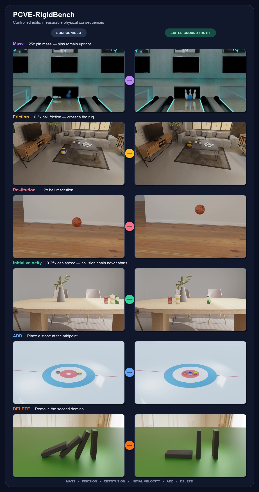

# PCVE-RigidBench

[](https://huggingface.co/datasets/ccmoony/PCVE-RigidBench)

A benchmark for evaluating physics-aware video editing models on rigid-body
interactions. The repository contains two parts:

1. **Benchmark construction** (`scripts/`) -- PyBullet simulation + Blender
   Cycles rendering to produce deterministic physical-interaction videos and
   matching ground-truth trajectories.
2. **Evaluation harness** (`eval/`) -- run a baseline model over the benchmark,
   then score its outputs with perceptual metrics (PSNR, SSIM, LPIPS, CLIP,
   FVD) and physics-grounded trajectory error.

The benchmark data (videos, ground-truth trajectories, edit manifests) is
hosted on Hugging Face:
[ccmoony/PCVE-RigidBench](https://huggingface.co/datasets/ccmoony/PCVE-RigidBench).

## Qualitative Cases

Each case pairs the same source scene with a controlled intervention and its
physically simulated counterfactual. The examples below cover every supported
edit type: mass, friction, restitution, initial velocity, ADD, and DELETE.



## Repository Layout

```
├── scripts/                    # Benchmark construction
│   ├── build_benchmark.py      # Build the full benchmark manifest
│   ├── pcve_edit_dsl.py        # Edit DSL: property changes, ADD/DELETE
│   ├── pcve_timed_edits.py     # Timed edits (AT FRAME n)
│   ├── download_render_assets.py
│   ├── <scene_name>/           # Per-scene simulation + render scripts
│   └── ...
├── eval/                       # Evaluation harness
│   ├── run_baseline.py         # (source, prompt) -> prediction.mp4
│   ├── compute_metrics.py      # prediction vs ground-truth -> metrics
│   ├── baselines/              # Baseline model wrappers
│   │   ├── wan_vace.py         #   Wan 2.1 VACE-14B
│   │   ├── ditto.py            #   Ditto
│   │   ├── void.py             #   VOID
│   │   └── stub.py             #   Copy-source sanity check
│   ├── metrics/                # Metric implementations
│   │   ├── perceptual.py       #   PSNR / SSIM / LPIPS / CLIP
│   │   ├── fvd.py              #   Fréchet Video Distance
│   │   ├── physics.py          #   Per-object trajectory error
│   │   ├── traj_lib.py         #   GT normalisation, projection, error
│   │   └── grounded_sam2_tracker.py  # GroundingDINO + SAM2 tracking
│   └── requirements.txt
├── videos/                     # Source + edited render outputs
└── requirements.txt            # Benchmark construction deps
```

## Benchmark Construction

The benchmark covers 20 rigid-body scenes (ball impact, drop, rebound,
incline, domino chain, bowling, curling, pool collision, etc.) with 129 edit
cases across five physical properties: **mass**, **friction**, **restitution**,
**initial velocity**, and **presence** (ADD/DELETE).

### Prerequisites

- Python 3.10+
- Blender 3.6 LTS (with Cycles)
- PyBullet

```bash
pip install -r requirements.txt
python scripts/download_render_assets.py
```

### Build the benchmark

```bash
python scripts/build_benchmark.py \
  --out-root /path/to/pcve_benchmark_v1 \
  --resolution 1280 720 --fps 24 --duration-sec 8 \
  --samples 32 --device auto
```

## Evaluation

### Setup

```bash
cd eval
pip install -r requirements.txt
```

For model-specific dependencies (e.g. Wan VACE, Ditto, VOID), see
[eval/README.md](eval/README.md).

### Evaluated Models

| Model | Reference | Scope in this benchmark |
|-------|-----------|-------------------------|
| Wan 2.1 VACE-14B | [VACE: All-in-One Video Creation and Editing (ICCV 2025)](https://arxiv.org/abs/2503.07598) | SET, ADD, and DELETE edits |
| Ditto / Editto | [Scaling Instruction-Based Video Editing with a High-Quality Synthetic Dataset (CVPR 2026)](https://arxiv.org/abs/2510.15742) | SET, ADD, and DELETE edits |
| VOID | [VOID: Video Object and Interaction Deletion (ECCV 2026)](https://arxiv.org/abs/2604.02296) | DELETE edits only |

### Run a baseline

```bash
BENCH=/path/to/pcve_benchmark_v1

# Generate predictions
python run_baseline.py --benchmark-root $BENCH \
    --baseline wan_vace_14b \
    --prompt-flavor quantitative --prompt-lang en \
    --skip-existing

# Score predictions
python compute_metrics.py --benchmark-root $BENCH --baseline wan_vace_14b
```

Outputs are written to `{benchmark_root}/predictions/{baseline}/`:

```
predictions/wan_vace_14b/
├── videos/{scene}/{case_id}.mp4
├── metrics.json          # per-case + aggregate
├── metrics.csv           # flat table for pandas
└── metrics_objects.csv   # per-object breakdown
```

### Metrics

| Category | Metrics |
|----------|---------|
| Perceptual | PSNR, SSIM, LPIPS, CLIP similarity, FVD |
| Physics | Trajectory displacement (`disp`), Gap Closed (`gap_closed`), Mask IoU (`mask_iou`) |

The three physics metrics answer different questions:

| Metric | What it tells you | Better |
|--------|------------------|--------|
| **Trajectory Displacement** | Does the object move as it should after the edit? | ↓ Lower; 0 is perfect motion |
| **Gap Closed** | How much error is removed compared with copying the unedited source? | ↑ Higher; 1 is perfect, 0 is baseline |
| **Mask IoU** | Does the object occupy the right pixels, with the right boundary? | ↑ Higher; 1 is identical masks |

#### Trajectory Displacement

Measures the difference in object motion after aligning each trajectory to its
own anchor position. **Lower is better.**

$$
d_t = \left\| \left(\mathbf{p}_t - \mathbf{p}_a\right) - \left(\mathbf{r}_t - \mathbf{r}_a\right) \right\|_2
$$

Here $\mathbf{p}_t$ and $\mathbf{r}_t$ are the predicted and edited-reference
centroids in pixels, tracked by GroundedSAM2. The anchor $a$ is the first valid
tracked frame at or after the seed that passes the reference visibility gate.
Subtracting each path's anchor removes constant positional offsets.

The per-object mean error over scored frames $\mathcal{T}$ is:

$$
E = \frac{1}{|\mathcal{T}|} \sum_{t \in \mathcal{T}} d_t
$$

For example, moving 80 px right when the reference moves 100 px right gives
a **20 px** error at that frame. `disp_mean_px` reports the mean in pixels;
`disp_mean_radii` divides it by the apparent object radius, with a minimum
scale of 12 px.

Reference frames where the object is off-screen or clipped are excluded.
For a lost prediction track while the reference remains fully visible, $d_t$
is replaced by the reference's distance to the nearest image edge as a penalty.

#### Gap Closed

Measures the fraction of trajectory error removed compared with copying the
unedited source clip (the null baseline). **Higher is better.**

$$
\mathrm{GapClosed} = 1 - \frac{\sum_{o \in \mathcal{O}} E_o^{\mathrm{pred}}}{\sum_{o \in \mathcal{O}} E_o^{\mathrm{null}}}
$$

$E_o^{\mathrm{pred}}$ and $E_o^{\mathrm{null}}$ are object $o$'s mean
displacement errors against the edited reference for the prediction and source
clip, respectively. $\mathcal{O}$ contains scored objects with a nonzero null
error. Errors are summed **before dividing**, so objects with tiny baseline
errors do not dominate through their individual ratios. If no usable baseline
denominator exists, the score is unavailable.

For example, reducing the summed error from **100 px to 25 px** gives
$1 - 25/100 = 0.75$: **75% of the gap closed**.

- **1.0:** zero scored trajectory error.
- **0.0:** the same aggregate error as copying the source.
- **Below 0:** worse than copying the source.

#### Mask IoU

Measures spatial overlap between the predicted and edited-reference object
masks. **Higher is better.**

$$
\mathrm{IoU}_t = \frac{\left|M_t^{\mathrm{pred}} \cap M_t^{\mathrm{ref}}\right|}{\left|M_t^{\mathrm{pred}} \cup M_t^{\mathrm{ref}}\right|}
$$

$$
\mathrm{MaskIoU} = \frac{1}{|\mathcal{T}|} \sum_{t \in \mathcal{T}} \mathrm{IoU}_t
$$

$M_t^{\mathrm{pred}}$ and $M_t^{\mathrm{ref}}$ are the two masks at frame $t$;
$\cap$ counts shared pixels, $\cup$ counts pixels covered by either mask, and
$\mathcal{T}$ contains this object's scored frames. The case score averages
the available per-object scores.

For example, **5,000 shared pixels / 15,000 covered pixels** gives an IoU of
**0.33**. A score of **0** means no overlap; **1** means identical masks.
This captures absolute position and object boundaries that displacement alone
cannot assess.

Both masks are checked for plausible area (0.3–3.0 times the source clip's
median mask area for that object); rejected masks are treated as absent.
One valid nonempty mask scores 0; neither side having one excludes the frame.
If no comparable frames remain, the object's score is unavailable.

See [eval/README.md](eval/README.md) for more details on tracking, seeding,
and per-object scoring.

## License

Code in this repository is released under the MIT License.
The benchmark data on Hugging Face follows its own license terms.
